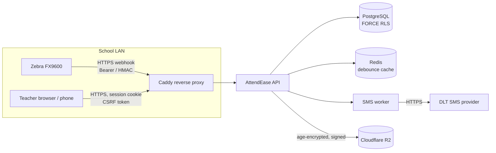

# AttendEase OS — Threat Model

This document specifies the security boundaries, assets, threat vectors (STRIDE), mitigations, and explicit non-goals for AttendEase OS.

## 1. System & Trust Boundaries

Security and trust boundaries:
- **(B1) Reader → API (School LAN)**: Untrusted local network traffic from hardware RFID reader to Caddy reverse proxy.
- **(B2) Browser / Phone → API**: Web sessions from teachers and administrators connecting over HTTPS.
- **(B3) API → Database**: Tenant-isolated PostgreSQL connection pool using `withTenantContext` and `FORCE ROW LEVEL SECURITY`.
- **(B4) API → SMS Provider**: Asynchronous parent absentee notification dispatch over external telecom HTTPS APIs.
- **(B5) Appliance → Off-site Backups**: Automated export of database snapshots to Cloudflare R2 object storage.
- **(B6) Physical Boundary: Badge ↔ Reader**: Over-the-air UHF RFID radio frequency transmission in the 865–868 MHz band.

---

## 2. Assets (Ranked by Sensitivity)

1. **Children's PII**: Full names (English and Bengali), student photos, class section assignments, roll numbers, and historical attendance timestamps.
2. **Guardian PII**: Parent/guardian contact phone numbers and relationship metadata.
3. **Attendance Integrity**: Accuracy and immutability of the record stating whether a child attended school on a given calendar date (drives official reports and automated parent absence SMS notifications).
4. **Cryptographic Secrets & Tokens**: Reader bearer tokens, HMAC webhook signing keys, session cookie signing keys, CSRF secret, database backup age recipient identity and signing keys, Cloudflare R2 storage credentials, and telecom DLT API credentials.
5. **Appliance Availability during Gate Rush**: Uninterrupted ingest throughput during the critical 45-minute arrival window (07:30–08:15 local time).

---

## 3. Threats (STRIDE Analysis per Boundary)

| ID | Boundary | STRIDE | Threat | Mitigation | Residual Risk |
|---|---|---|---|---|---|
| **R1** | B1 | Spoofing | Attacker on local LAN posts forged badge read batches to webhook | Per-reader bearer token (hashed with server-side pepper at rest) or HMAC-SHA256 signature calculated over raw request body; constant-time string comparison; uniform HTTP 401 rejection responses; per-reader rate limiting | Reader hardware physical compromise or stolen config export. Mitigation: revoke and rotate compromised reader token via `Admin > Readers > Rotate Token` ([Key Rotation Guide](docs/operations/key-rotation.md)). |
| **R2** | B1 | Tampering / Replay | Attacker replays captured HTTP webhook payloads from earlier days | Mandatory idempotency keys per read; rejection of batches with timestamps outside today's school calendar (`WRONG_SCHOOL_DAY`) or in the future (`FUTURE_SKEW`) | Same-day replay of an unrecorded read with valid timestamp if reader token is compromised. |
| **R3** | B1 | Denial of Service | Flooding the appliance with massive JSON batches during morning rush | Strict 512 KB request payload limit (`LIMITS.zebraWebhook`), batch cap of 250 reads per POST, rate limiting, and memory-safe batched database queries | Sustained gigabit LAN network flooding can saturate appliance NIC. |
| **R4** | B6 | Spoofing | **EPC Cloning**: Copying a badge's EPC identifier to a blank tag using a handheld RFID writer (EPC Gen2 tags broadcast EPC in the clear) | No cryptographic air-interface protection exists on standard UHF Gen2 EPC tags. Detective controls: anomaly detection for duplicate arrival in different gates, impossible travel, and teacher roster review displaying student photographs | **High, Accepted Risk.** UHF RFID physics proves that an authorized *badge* crossed the gate antenna beam, not which individual carried it. Disclosed transparently to schools. |
| **R5** | B6 | Repudiation | Student carries classmate's badge through gate while friend is absent | Classroom teacher visual roll review with student photos; audit logs showing discrepancy between gate tap and classroom absence | Accepted procedural risk; resolved during teacher roll finalization. |
| **R6** | B6 | Information Disclosure | Passive read of students walking past gate without entering school grounds | Physical directional antenna beam tuning, RSSI threshold calibration, and gate direction logic | Site-dependent; mitigated during site installation tuning protocol. |
| **R7** | B6 | Information Disclosure | Third party with handheld UHF reader scans student badges outside school to track movements | EPC values contain purely opaque identifiers (salted digests stored on server; no student names or personal data written to tag chip memory). EPC values recommended to be assigned randomly rather than sequentially | The badge emits a consistent opaque hexadecimal number when queried. Disclosed to school administrators. |
| **W1** | B2 | Spoofing | Credential stuffing against web login portal | Argon2id password hashing, IP rate limiting, account lockout after repeated failed attempts | Distributed credential stuffing across multiple proxies. |
| **W2** | B2 | Tampering | Cross-Site Request Forgery (CSRF) | Cryptographically bound double-submit CSRF cookie token, Origin header validation, strict path matching, and zero cookie parsing on machine/webhook routes | Cross-site interaction prevented by browser security sandbox. |
| **W3** | B2 | Elevation of Privilege | Teacher attempts to modify records of another school or unassigned class section | Role-based authorization (`requireRole`), path-scoped `schoolId` validation, and PostgreSQL RLS tenant confinement | Bug in application authorization logic (mitigated by automated test suites). |
| **W4** | B2 | Information Disclosure | Mass assignment or over-fetching in API responses | Strict Zod validation schemas (`.strict()`); webhook responses return only counts and opaque digest IDs (no student names) | None identified. |
| **W5** | B2 | Elevation of Privilege | First-run setup wizard re-invoked post deployment | Permanent database lockdown flag upon first admin user creation; attempts to re-initialize return HTTP 403 with audit alert | Direct raw root database access on host machine. |
| **D1** | B3 | Information Disclosure | Cross-tenant data leakage via pooled database connection reuse | Mandatory transaction-local `withTenantContext` setting `set_config('app.current_school_id', ..., true)` within active transaction; session-level config forbidden by CI guardrail; RLS fails closed | None identified with transaction-local context. |
| **D2** | B3 | Elevation of Privilege | Application database user bypasses RLS policies | PostgreSQL `FORCE ROW LEVEL SECURITY` enforced on all tenant tables; dedicated non-superuser application role `attendease_app` without `BYPASSRLS` privileges; separate system role | Database superuser access on the host system. |
| **S1** | B4 | Tampering | **False Absent SMS Notification to Guardian** (system or teacher error sending wrong alert to parent) | Session finalization requires explicit teacher action; manual teacher overrides are never overwritten by automated gate sync; optional configurable SMS dispatch delay window allowing teacher corrections | A wrongful absence alert causes genuine parental distress. Mitigated by procedural roll check and correction dispatch runbook. |
| **S2** | B4 | Spoofing | Forged delivery report callbacks from telecom gateway | Cryptographic HMAC validation on inbound delivery status callback webhooks | Telecom provider network compromise. |
| **B1x** | B5 | Information Disclosure | Theft of encrypted database backup archive from local storage or Cloudflare R2 | Envelope encryption using `age` public-key cryptography; backup key generation separates encryption recipient from decryption private identity | Decryption key compromised if stored in cleartext on the same host without offline air-gap. |
| **B2x** | B5 | Tampering | Restoring a tampered or malicious database backup file | Digital signature and manifest SHA-256 verification before decryption; single-transaction restore with pre-flight `--dry-run` validation | Compromise of both backup signing private key and age private key. |
| **O1** | Ops | Elevation of Privilege | Supply chain compromise (NPM packages, container base image) | Pinned package-lock.json dependencies, pinned GitHub Actions SHAs, automated Knip/Depcruise checks, and container vulnerability scanning | Zero-day dependency compromise. |
| **O2** | Ops | Information Disclosure | Sensitive credentials or children PII leaked in application logs | Pino logger redaction filters (masks bearer tokens, EPC tags, passwords, and phone numbers); query strings excluded from request logs | Ad-hoc debugging statements (monitored by CI guardrails). |
| **P1** | Physical | All | Physical theft of the on-premise appliance hardware | Full-disk encryption (LUKS) recommended on host OS; ability to immediately revoke reader credentials and session tokens from remote backup | Hardware seizure while machine is powered on and unlocked in memory. |

---

## 4. Explicit Non-Goals & Limitations

- AttendEase OS does **not** perform biometric identity verification (no facial recognition, fingerprinting, or iris scanning).
- UHF RFID tags are **not** secure access credentials; they must never be used for door locks, perimeter security, or financial transactions.
- AttendEase OS does **not** provide legal or regulatory compliance certification; refer to the [Data Protection Overview](docs/explanation/data-protection.md) for data handling details.
- Imports and exports utilize standard CSV and formatted spreadsheet formats; raw macro execution is not supported.

---

## 5. Review Cadence & Audit Schedule

This threat model is reviewed upon:
1. Introduction of new hardware or network interfaces.
2. Major modifications to authentication or tenant isolation mechanisms.
3. Addition of new PII data categories.
4. Regular 6-month security review cadence.

Last code review: Commit `cc059c4` (October 2026).  
Independent penetration test: *Pending scheduling for production pilot phase* (see `docs/evidence/`).
