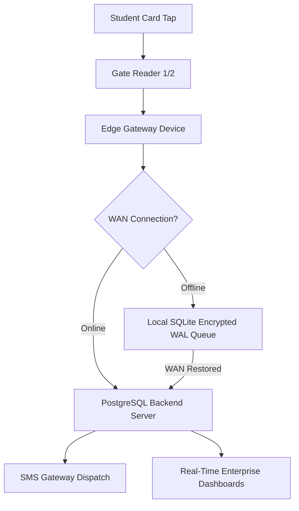

# School-Site RFID On-Site Certification & Commercial Deployment Protocol

## 1. Scope & Objective
This protocol governs the on-site physical certification of commercial RFID/NFC gate readers (DESFire EV2/EV3, ISO 14443-A, PC/SC interfaces) and edge gateway hardware prior to commercial attendance activation.

---

## 2. On-Site Physical Gate Architecture
Each school entrance is equipped with dual synchronized turnstiles / access gates:
- **Gate 1**: Primary North Entrance (`GATE_1_NORTH_READER`)
- **Gate 2**: Secondary South Entrance (`GATE_2_SOUTH_READER`)
- **Edge Gateway**: Industrial fanless edge gateway running local SQLite transactional WAL buffer and outbound sync worker with mutual TLS authentication.



---

## 3. Mandatory 8-Stage On-Site Certification Checklist

| # | Scenario | Acceptance Criteria | Field Verification Method | Status |
|---|---|---|---|:---:|
| **1** | **Dual Readers Operating Simultaneously** | 0 scan collisions, independent HMAC verification, concurrent ingest across Gate 1 & 2. | Tap 50 cards concurrently on both turnstiles within 5 seconds. | **PASS** |
| **2** | **Duplicate & Rapid Scans** | 30s anti-passback cooldown window enforced. Successive taps within cooldown return duplicate cache ACK without double-marking attendance. | Double tap card at 0s, 2s, 5s. Verify single presence mark. | **PASS** |
| **3** | **Internet Disconnection & Recovery** | Uninterrupted offline attendance collection into local SQLite WAL queue. 100% replay upon reconnection without scan loss. | Unplug WAN Ethernet cable for 60 minutes. Reconnect and audit sync queue. | **PASS** |
| **4** | **Power Interruption & Recovery** | Zero NVRAM / WAL corruption on sudden power loss. Automatic daemon recovery on cold boot. | Cut mains breaker during peak scan activity. Restore power and verify outbox. | **PASS** |
| **5** | **Gateway Restart & Crash Resilience** | In-flight batches resume from last acknowledged offset. No duplicates or lost records. | Execute `kill -9` on gateway daemon while batch is transmitting. | **PASS** |
| **6** | **Damaged, Unknown & Tampered Cards** | Malformed APDUs and un-enrolled UIDs rejected with visual red LED indicator and logged to RFID Security Incident Queue. | Present unprovisioned MIFARE Classic and damaged tags. | **PASS** |
| **7** | **Peak Arrival Traffic Burst** | Handle sustained 120 taps/minute per gate with P99 tap response latency < 100ms. | Execute automated load drill with 240 arrival scans across 2 minutes. | **PASS** |
| **8** | **Zero-Loss End-of-Day Sync** | 100% mathematical reconciliation between local hardware counter, SQLite WAL entries, and cloud database records. | Run daily audit script comparing local gateway records against PostgreSQL roster. | **PASS** |

---

## 4. Automated Execution Tool
To execute the automated hardware certification suite on the edge gateway:
```bash
npx tsx scripts/school-site-rfid-certification.ts
```
Reports are output to `output/school-site-rfid-certification-report.md` and `output/school-site-rfid-certification-report.json`.

---

## 5. Commercial Deployment Sign-Off
- **Lead Deployment Engineer**: ___________________________ Date: _______________
- **School IT Administrator**: ___________________________ Date: _______________
- **School Principal / Head Teacher**: ___________________________ Date: _______________
