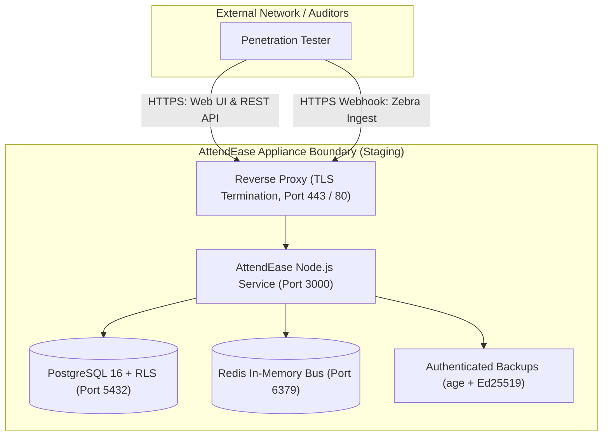

# AttendEase OS — External Penetration Testing Scope & Engagement Rules

**Target System**: AttendEase OS (Offline QR & Fixed UHF RFID School Attendance Appliance)  
**Classification**: Educational Critical Infrastructure / Student & Guardian PII  
**Engagement Type**: White-Box / Grey-Box Web Application, API, Appliance & Cryptographic Security Audit  
**Document Version**: 1.0 (Milestone 1 — Security Hardening Phase 1)  

---

## 1. Executive Summary & Purpose

AttendEase OS is an on-premises school attendance appliance engineered for rural and semi-urban secondary schools in West Bengal and greater India. It combines local offline QR code scanning with automated fixed-gate Zebra FX9600 UHF RFID ingress and automated DLT-compliant SMS notifications to guardians.

This document establishes the official scope, rules of engagement (RoE), testing accounts, machine authentication fixtures, and high-priority testing scenarios for external penetration testing firms and independent security auditors.

---

## 2. Staging Environment & Testing Infrastructure

Penetration testing MUST be performed against a dedicated staging environment populated with realistic, synthetic multi-tenant school data.

- **Staging Base URL**: `https://staging.attendease.internal` (or designated staging host)
- **Database Seeding**: Provisioned via `npm run seed` (creates multi-tenant schools, academic years, classes, students, and readers).

---

## 3. Pre-Seeded Testing Accounts (2× per Role for Clean IDOR Testing)

To rigorously audit for **Insecure Direct Object References (IDOR)** and cross-tenant data leakage, exactly two distinct test accounts are provided for each privilege tier across two separate school tenants:
- **Tenant A**: Rampur High School (`udiseCode`: `19100100101`)
- **Tenant B**: Haripur High School (`udiseCode`: `19100100102`)

| Role | User Identifier / Phone | Assigned Scope | Default Password | Testing Focus |
| :--- | :--- | :--- | :--- | :--- |
| **SUPER_ADMIN (1)** | `+919000000000` | Global Multi-Tenant | `SuperSecretAdminPassword123!` | System configuration, school provisioning, audit logs |
| **SUPER_ADMIN (2)** | `+919000000001` | Global Multi-Tenant | `SuperSecretAdminPassword123!` | Concurrent admin actions, session revocation |
| **SCHOOL_ADMIN (A)** | `+919100000001` | Rampur High School (A) | `SchoolAdminPassword123!` | School A admin capabilities; verify cannot access School B |
| **SCHOOL_ADMIN (B)** | `+919200000001` | Haripur High School (B) | `SchoolAdminPassword123!` | School B admin capabilities; verify cannot access School A |
| **TEACHER (A1)** | `+919100000002` | Rampur HS — Class 5A | `TeacherPassword123!` | Class 5A roster, attendance marking; verify cannot access Class 6A |
| **TEACHER (A2)** | `+919100000005` | Rampur HS — Class 6A | `TeacherPassword123!` | Class 6A roster; same school as A1, distinct section |
| **TEACHER (B1)** | `+919200000002` | Haripur HS — Class 6A | `TeacherPassword123!` | Cross-school teacher IDOR; verify cannot view School A classes |
| **TEACHER (B2)** | `+919200000003` | Haripur HS — History Dept | `TeacherPassword123!` | Unassigned section access testing |
| **RFID_OPERATOR (A)** | `+919100000003` | Rampur HS — Station | `RfidOpPassword123!` | Gate turnstile live console, tag enrollment |
| **RFID_OPERATOR (B)** | `+919200000004` | Haripur HS — Station | `RfidOpPassword123!` | Verify RFID operator cannot inspect other school gates |
| **REPORT_VIEWER (A)** | `+919100000004` | Rampur HS — District Audit | `ReportViewerPassword123!` | Read-only export access; verify cannot mutate records |

---

## 4. Machine Authentication Credentials (Testing Without Hardware)

The Zebra FX9600 IoT Connector communicates via authenticated HTTP webhooks. Pre-seeded reader devices allow penetration testers to simulate reader hardware without physical readers:

### School A Reader Fixture
- **Reader Device ID**: `ZEBRA-FX9600-SCH-A-GATE1`
- **Assigned School**: Rampur High School (School A)
- **Status**: `ACTIVE`
- **Bearer Token**: `aerdr_TestSchoolAGateReaderToken2026Secure01234xx`
- **Token Hint**: `34xx`
- **Ingest Endpoint**: `POST /api/v1/schools/<schoolA_id>/rfid/zebra/reads`

### School B Reader Fixture
- **Reader Device ID**: `ZEBRA-FX9600-SCH-B-GATE1`
- **Assigned School**: Haripur High School (School B)
- **Status**: `ACTIVE`
- **Bearer Token**: `aerdr_TestSchoolBGateReaderToken2026Secure56789xx`
- **Token Hint**: `89xx`
- **Ingest Endpoint**: `POST /api/v1/schools/<schoolB_id>/rfid/zebra/reads`

---

## 5. In-Scope Targets & Attack Surfaces

The following components and interfaces are strictly **IN-SCOPE**:

### 5.1 Web Application & REST API
1. **Authentication & Session Management**:
   - `/api/v1/auth/login`, `/api/v1/auth/logout`, `/api/v1/auth/me`, `/api/v1/auth/csrf`
   - Session cookie security (`HttpOnly`, `Secure`, `SameSite=Lax`, SHA-256 session token hashing, idle timeout).
2. **Multi-Tenant Routing & RLS**:
   - `/api/v1/schools/:schoolId/...`
   - Path-based school resolution (`resolveSchoolId` middleware) and mismatch rejection (`SCHOOL_ID_MISMATCH`).
   - PostgreSQL Row Level Security (RLS) enforcement under non-superuser database connections.
3. **Machine Webhook Endpoints**:
   - `POST /api/v1/schools/:schoolId/rfid/zebra/reads` (Zebra IoT Connector webhook)
   - `POST /api/v1/schools/:schoolId/rfid/scans` (Gateway hardware scan ingest)
   - `POST /api/v1/notifications/callback` (DLT telecom provider delivery receipt webhook)
4. **Token Lifecycle & Key Management**:
   - `POST /api/v1/schools/:schoolId/rfid/readers/:readerId/rotate-token` (Reader token rotation & instant revocation)
5. **Report & Export Generation**:
   - Excel/CSV export generation (Formula injection sanitization for `=,+,-,@,\t,\r`).

### 5.2 Appliance System Boundaries
1. **Backup Integrity & Encryption Pipeline**:
   - `scripts/install.sh backup` (Creates `.dump.age`, `.manifest.json`, `.sig` via `age` + `ssh-keygen -Y`).
   - `scripts/install.sh restore` and `--verify-only` (Pre-decryption Ed25519 signature & SHA-256 verification).
2. **Appliance CLI Tooling**:
   - `bin/attendease` administrative command interface.

---

## 6. Out-of-Scope Targets

The following systems, components, and techniques are strictly **OUT-OF-SCOPE**:

1. **Third-Party Telephony / DLT Gateways**:
   - External Indian Telecom DLT platforms (NIC, C-DAC, Jio, Airtel, Vi, Vodafone SMS gateways). Testers must evaluate webhook callback parsers using mocked status payloads.
2. **Cloudflare Infrastructure / R2 Storage Control Plane**:
   - Upstream Cloudflare dashboard, DNS, and edge network controls.
3. **Upstream Network Infrastructure**:
   - Upstream ISP routing, BGP, authoritative NTP/DNS server infrastructure.
4. **Physical Appliance Enclosures & Tamper Switches**:
   - Physical enclosure drilling, reader casing tamper microswitches, or hardware JTAG probing of deployed turnstiles.

---

## 7. Rules of Engagement (RoE) & Operational Constraints

1. **Denial of Service (DoS/DDoS)**:
   - Automated volume flood testing or destructive DoS attacks that exhaust server memory, saturate network bandwidth, or crash the staging host are **strictly prohibited**.
2. **Data Destruction & PII**:
   - All tests must use synthetic seeded data. Testers must not attempt to modify, destroy, or exfiltrate production data.
3. **Automated Scanning Rate Limits**:
   - Automated scanners (e.g. Burp Suite Active Scanner, OWASP ZAP) must be throttled to $\le 10$ requests per second to avoid triggering appliance firewall bans or false-positive rate-limit locks.
4. **Critical Finding Notification SLA**:
   - If any **Critical** severity vulnerability is discovered (e.g., Unauthenticated Remote Code Execution, Complete Tenant Isolation Bypass / Cross-School Data Exfiltration, Private Key Extraction), the testing team must notify the AttendEase Security Response Team within **2 hours** with reproduction steps.

---

## 8. Specific Audit Focus Areas & Test Cases

| Category | High-Priority Test Objective | Expected Hardened Behavior |
| :--- | :--- | :--- |
| **CSRF** | Exemption smuggling via query string (`POST /students?x=/rfid/scans`) | Request must be rejected with `403 FORBIDDEN` (path matcher strictly ignores query strings). |
| **CSRF** | Browser cookie sent to machine route (`/rfid/zebra/reads`) | Request must be rejected with `403 CSRF_COOKIE_ON_MACHINE_ROUTE`. |
| **Tenant Isolation** | Single-source path ID vs Header/Body smuggling (`x-school-id` mismatch) | Request must be rejected with `400 SCHOOL_ID_MISMATCH`. |
| **Tenant Isolation** | Teacher A1 requests Teacher B1 student attendance record | Database RLS & application context return `404` or `403` with zero records leaked. |
| **RFID Auth** | Using reader HMAC secret as Bearer token in `/zebra/reads` | Authentication must fail with uniform `401 UNAUTHORIZED_READER`. |
| **RFID Auth** | Token rotation followed by immediate replay of old bearer token | Old token must fail on the very next request with `401 UNAUTHORIZED_READER`. |
| **RFID Ingest** | Clock skew / replay testing ($\Delta t > 15$ min or future timestamps $> 2$ min) | Tag reads flagged as `LATE_BUFFERED` or `FUTURE_SKEW`; zero silent overwrites. |
| **Payload Limits** | Oversized JSON payloads ($> 512$ KB on Zebra, $> 100$ KB elsewhere) | Parser returns clean `413 PAYLOAD_TOO_LARGE` without echoing back stack trace or system errors. |
| **Information Leak** | Invalid reader, wrong school, or bad token in `/zebra/reads` | Returns identical timing-neutral `401 UNAUTHORIZED_READER` with uniform structure and no internal details. |
| **Backups** | Modifying 1 bit in backup ciphertext (`.dump.age`) or forging manifest | Restore process must abort immediately during signature/hash verification **BEFORE** invoking `age -d`. |
